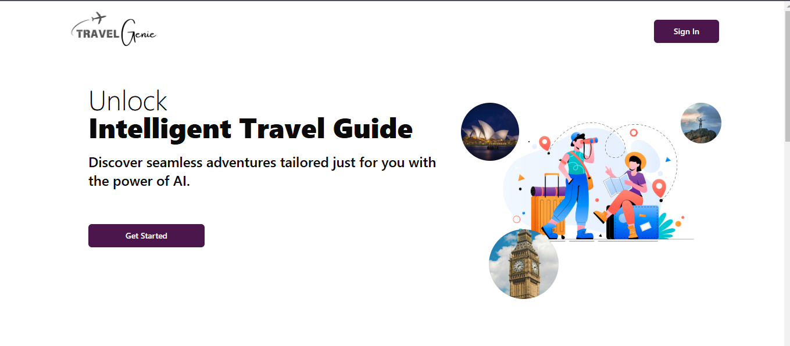
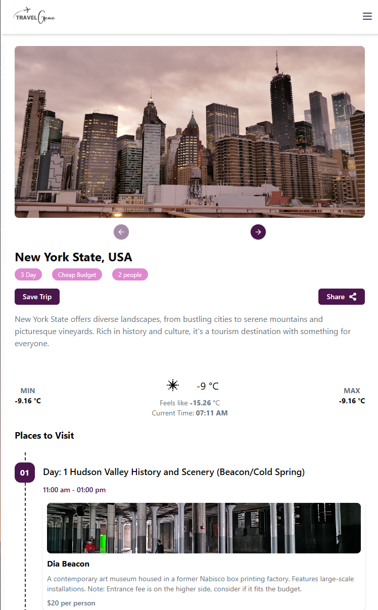

# Travel Genie

## Introduction

Travel Genie is an intelligent travel planning web application that uses AI to generate custom travel itineraries based on user inputs. Whether you're traveling solo, as a couple, with family, or in a group, Travel Genie helps you discover the best attractions, dining options, and unique experiences tailored to your preferences. Leveraging cutting-edge technologies such as React, Vite, Tailwind CSS, Firebase, and Google's AI services, Travel Genie offers a seamless, interactive, and personalized trip planning experience.

Live demo, visit [Travel Genie](https://travel-genie-eight.vercel.app/)

## Table of Contents

- [Demo](#demo)
- [Features](#features)
- [Tech Stack](#tech-stack)
- [Installation](#installation)
- [Usage](#usage)
- [Configuration](#configuration)

## Demo


_Screenshot 1_


_Screenshot 2_

## Features

- **Personalized Itineraries:** Generate travel itineraries based on destination, duration, travel party size, and budget.
- **Google Places Integration:** Easily search for destinations using Google Places Autocomplete.
- **User Authentication:** Secure access via Google OAuth.
- **Interactive Dashboards:** View and manage your profile, trips, and generated itineraries.
- **Firebase Integration:** Store and retrieve user profiles and trip data using Firebase Firestore.
- **Responsive Design:** Enjoy a seamless experience across desktop and mobile devices.
- **AI-Powered Recommendations:** Receive tailored travel plans with suggestions on sightseeing, dining, and unique local experiences.

## Tech Stack

- **Frontend:** React, Vite, React Router, Tailwind CSS
- **UI Libraries:** Radix UI, Lucide Icons, Sonner, Embla Carousel
- **Backend Services:** Firebase (Firestore)
- **APIs:** Google Generative AI, Google Places API, Booking.com API (for hotel suggestions)
- **Authentication:** Google OAuth
- **Utilities:** Axios, class-variance-authority, clsx, date-fns

## Installation

1. **Clone the Repository:**

   ```bash
   git clone https://github.com/aimless-coder/travel_genie.git
   cd travel_genie
   ```

2. **Install Dependencies:**

   Ensure you have Node.js installed, then run:

   ```bash
   npm install
   ```

3. **Environment Variables:**

   Create a `.env` file in the project root and add the following environment variables with your respective API keys and configuration values:

   ```env
   VITE_GOOGLE_AUTH_CLIENT_ID=your_google_auth_client_id
   VITE_GOOGLE_PLACE_API_KEY=your_google_place_api_key
   VITE_FIRESTORE_API_KEY=your_firestore_api_key
   VITE_GOOGLE_GEMINI_API_KEY=your_google_gemini_api_key
   ```

4. **Start the Development Server:**

   ```bash
   npm run dev
   ```

## Usage

- **Home Page:** Visit the home page to see an introduction to the app and its primary features.
- **Sign In:** Click on the Sign In button to authenticate using your Google account.
- **Plan Your Trip:** Navigate to the "Create Trip" section, where you can input your destination, trip duration, budget, and travel party details.
- **Generate Itinerary:** Hit the "Generate Trip" button to receive an AI-powered travel itinerary along with details on hotels, attractions, and dining options.
- **Dashboard:** Once signed in, access your dashboard to view your profile, update preferences, and revisit your generated trips.

## Configuration

- Update Firebase settings in `src/service/FirebaseConfig.jsx` according to your Firebase project configuration.
- Ensure all API keys are correctly set in your `.env` file for proper integration with Google and other third-party services.

